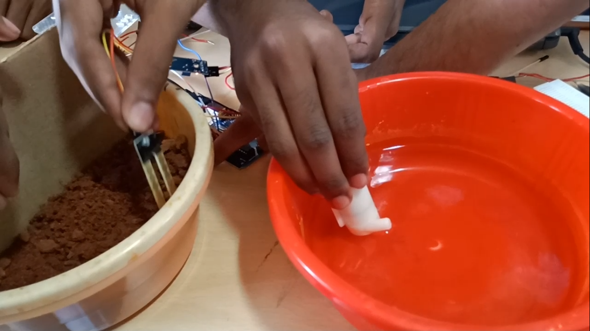

# Crop_moiseture_monitering_system

# Arduino Uno : 
Arduino/Genuino Uno is a microcontroller board based on the ATmega328P (datasheet). It has 14 digital input/output pins (of which 6 can be used as PWM outputs), 6 analog inputs, a 16 MHz quartz crystal, a USB connection, a power jack, an ICSP header and a reset button. It contains everything needed to support the microcontroller; simply connect it to a computer with a USB cable or power it with a AC-to-DC adapter or battery to get started.. You can tinker with your UNO without worring too much about doing something wrong, worst case scenario you can replace the chip for a few dollars and start over again.

In this project. Based on te moisture in soil. The motor will turn on. It has a threshold value of mositure level. If it is lower then moisture controller will turn on the motor then It start pumping the water. Then after it reached some threshold value it stop watering. Based on that we can automate watering .

